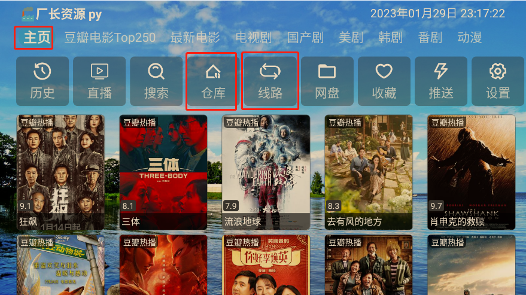

# TVBox系列软件的简要配置方法

---

## 0.只需两步，开始您的观影时光 !

- [x] **1. 下载并安装应用到您的系统上**
    - [ ] 下载影视仓或 TVbox 到U盘，将其安装到基于Android的电视系统上。
    - [ ] 其它系统的安装使用 参见 [6.多系统的使用](#6多系统的使用 )

- [x] **2. 配置数据源，开始观影！**
    - [ ] 配置您喜爱的观影数据源 参见 [4.数据源的配置](#4数据源的配置)
    - [ ] 选择合适的线路，开始观影！

## 1.TVBox简介
TVBox 是一款开源的，自定义添加站源的影音工具。TVBox 本身不具有任何影视资源，很大程度上避免了影视版权问题。TVBox 支持全球范围内的频道直播，可通过 IPTV 源进行配置，同时也可以通过配置数据源搜索各影视站点资源。TVBox 是在  <i class="icon-github icon-2x"></i> GitHub 上的一个开源项目，目前已有多个分支。影视仓是TVBox其中的一个分支。

项目链接：
1. https://github.com/o0HalfLife0o/TVBoxOSC
2. https://github.com/CatVodTVOfficial/TVBoxOSC

也可以通过此链接直接下载 [TVBox_takagen99_20230106-2252.apk](https://github.com/o0HalfLife0o/TVBoxOSC/releases/download/20230106-2252/TVBox_takagen99_20230106-2252.apk)

## 2.影视仓简介 
影视仓是多仓库版的TVBox，通过使用多个仓库的形式，很大程度上避免了 TVBox 中一个数据源失效，就需频繁更换数据源的不足。因此推荐使用 **影视仓** 进行观影。
下载链接 [影视仓_4.0.3.apk](https://liucn.lanzouf.com/i8bE20k6skgb)

## 3.安装方法
- 下载apk文件到U盘，将U盘插入电视安装 （部分电视需要开启**商场模式**才能安装）
- 通过智能电视的文件传输，将下载的文件传到电视安装
- 通过电视浏览器直接打开链接安装

影视仓 应用安装完毕后，还只是一个单纯的影视播放器，如果想播放影视，还需要进行设置，添加播放源。

## 4.数据源的配置

数据源接口是 **TVBox** 与 **影视仓** 的核心所在，它是一个编译好的JSON文件或者是TXT文件。通过数据源接口文件可将影片加载至播放器中，接口支持网络接口和本地文件。为了使用方便，通常是直接复制数据源接口网址，在配置地址中粘贴在配置地址处。

|  接口形式  |    优点    |    缺点    |
|  :------: | :-------:  | :-------:  |
|  网络接口  |  省时省力  |  无法保证内容质量，可能出现连接问题  |
|  本地文件  |  维护接口文件费事  |   能够保证内容质量和连接速度  |
|  网盘文件  |  使用网盘内文件，自定义程度高  |  需一定技术搭建环境  |

**注意**：
1. 由于网络接口文件来自网络他人维护，无法保障其安全性，部分接口文件可能包含 **成人信息**，强烈建议在**家庭、工作环境**搭建、观影时，谨慎选择数据源，最好能够挑选优质数据源并自行维护。
2. 如果使用网盘文件作为接口，推荐使用 **alist 网盘**，[ALIST](https://alist.nn.ci/) 可以聚合挂载现有的多种网盘，简单易用。
3. 本地接口文件适合在经过一段时间的使用后，挑选优质仓库自己维护。

**可供测试的链接：**
1. 网络中他人维护的线路文件 ： http://byyds.top/w.txt
2. 网络中他人维护的多源仓库文件： https://raw.liucn.cc/box/dm.txt

链接的具体使用方法见 [5.实践操作](#5实践操作)，如需更多链接可自行google。

## 5.实践操作

操作环境：Windows 使用MuMu模拟器模拟android环境

操作应用：影视仓

使用多源仓库文件：https://raw.liucn.cc/box/dm.txt

**如果网络问题无法加载图片请访问** ： https://www.cnblogs.com/MahoChan/p/17076018.html

1. 
- 安装并打开影视仓
2. 
- 数据源导入后的页面，数据源不同主页的内容也会不一样
3. 
- 点击设置可以进入到配置页面，在设置中可以看到仓库、线路、数据源的选项。
- 在影视仓中，仓库包含多条线路，线路包含多个数据源。可以更换仓库、线路、数据源来读取不同的资源。
- 配置仓库使用仓库文件，配置线路使用线路文件，**二者不可混用**，究其原因是Json文件中的格式不同。
4. 
- 点击切换多源仓库可以进入到配置页面，可以通过手机扫码在手机上配置，也可以直接在电视上输入链接。此处输入测试用的仓库文件链接 https://raw.liucn.cc/box/dm.txt 。本次测试选择了第二个仓库。
5. 
- 在配置好仓库后，可以选择一个线路，再选择一个首页数据源，就可以观影了。**线路的选择会影响能够选择的数据源和直播源，如果您没有找到心仪的数据源和直播源，建议更换线路和仓库。**
6. 
- 如果使用的是TVBox 不支持仓库配置，则需要配置地址，这里的地址指的是线路地址。可以将线路地址 http://byyds.top/w.txt 进行配置，同样可以支持二维码配置。
7. 
- 配置完后以后，如果想快捷更改线路，可使用主页上的仓库、线路、主页按键进行切换。
8.  
- 快捷切换仓库
9.  
- 快捷切换线路
10. 
- 快捷切换数据源
11. 
- 至此，您可以愉快的观影了。

12. 
- 您如果希望观看直播，可以进入直播页面，并配置直播源，刚刚导入的仓库文件中有些已经配置了直播源，因此不需额外操作就能观看。但此时的直播源并不多，可以通过**切换线路来加载更多的直播源**。这是因为直播地址是在线路配置完成之后导入的，切换线路可以加载直播地址并保留在电视中，如果切换足够多的线路，可以将足够多的直播源保留在电视中。
- 如果希望添加其它直播源，可以根据 [IPTV源](https://www.githubs.cn/projects/157616880-iptv) 进行配置。
13. 
- 直播示例

14. 
- 直播示例

15. 
- 直播示例

16. 
- 直播示例

祝您观影愉快！

## 6.多系统的使用
-  Windows 系统可以通过使用模拟器实现观影，测试过程使用的是网易的手游模拟器 [MuMu模拟器](https://mumu.163.com/)。

- Android 和基于 Android 的电视可直接使用TVBox系列，如希望竖屏版观影，可以下载 [影音壳子1.4.1.apk](https://liucn.lanzouf.com/iZlVl0jsm5kf)，配置同上。

- Ios 和基于 Ios 的AppleTvOS MacOS 可下载 [Kodi](https://kodi.tv/download) 或其它软件自行配置。

- 树莓派(Raspberry Pi)、Linux 可下载 [Kodi](https://kodi.tv/download) 或其它软件自行配置。

## 7.免责声明
本文旨在技术学习，所提供数据源连接仅供测试使用，严禁用于商业等用途，如有侵权，请联系删除。